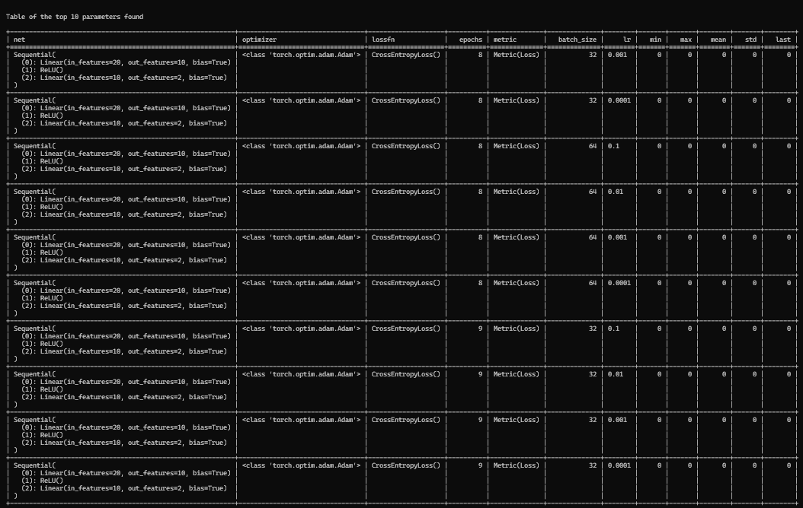

# torchgs

Pytorch wrapper for grid search of hyperparameters

## Example
Finding the best set of hyper-parameters and models for a classification problem

```python
from sklearn.datasets import make_classification

import torch
import torch.nn as nn

from torch.utils.data import TensorDataset

from torchgs import GridSearch

from torchgs.metrics import Loss

X,Y = make_classification(n_samples=200, n_features=20, n_informative=10,n_classes=2,shuffle=True, random_state=42)

X = torch.Tensor(X).float()
Y = torch.Tensor(Y).long()

traindata = TensorDataset(X,Y)

net1 = nn.Sequential(
    nn.Linear(20,10),
    nn.ReLU(),
    nn.Linear(10,2)
)

net2 = nn.Sequential(
    nn.Linear(20,10),
    nn.Tanh(),
    nn.Linear(10,2)
)

net3 = nn.Sequential(
    nn.Linear(20,20),
    nn.ReLU(),
    nn.Linear(20,10),
    nn.ReLU(),
    nn.Linear(10,2)
)

net4 = nn.Sequential(
    nn.Linear(20,20),
    nn.Tanh(),
    nn.Linear(20,10),
    nn.Tanh(),
    nn.Linear(10,2)
)


search_space = {
    'trainer':
        {
            'net': [net1,net2,net3,net4],
            'optimizer': [torch.optim.Adam],
            'lossfn': [torch.nn.CrossEntropyLoss()],
            'epochs': list(range(11)),
            'metric': [Loss(torch.nn.CrossEntropyLoss())],
        },
    'train_loader': {
        'batch_size': [32,64],
    },

    'optimizer':
        {
            'lr': [1e-1,1e-2,1e-3,1e-4],
    },
}

searcher = GridSearch(search_space)
results = searcher.fit(traindata)
best = searcher.best(results,using='mean',topk=10,should_print=True)
```
Output

